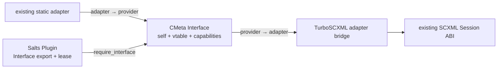

# CMeta provider interfaces

TurboSCXML keeps its existing bounded adapter ABIs as the session-facing
execution contract, but publishes canonical provider identity through CMeta
Interface.

## Why Interface, not FunctionDesc

Event I/O, invocation and resource callbacks are stateful provider methods.
They carry borrowed request pointers, output tickets/resources and error
pointers. They are not ordinary CMeta VALUE callables and must not be assigned
fake scalar FunctionDesc semantics.

CMeta Interface already models this exact shape:

```text
provider
  = { self, vtable }
  + implementation identity
  + capability bits
  + method names / dispatch arity
```

TurboSCXML therefore uses CMeta legacy exact-ABI interface rows for these
pointer-rich callbacks. FunctionDesc/FunctionAbi remain reserved for methods
whose semantic/native callable contract is actually representable.

## Canonical providers



Current interfaces:

- `scxml_event_io_provider`
- `scxml_invoke_provider`
- `scxml_data_resource_provider` for canonical raw DataBind resources
- `scxml_text_resource_provider` for compile-time text resources

Future VoiceXML prompt/collect/telephony providers should reuse this pattern
rather than create another provider registry or dynamic-module ABI.

## Capability and authority rules

Reflection is descriptive, not authority-granting.

- Event I/O capability dependencies remain identical to
  `scxml_event_io_adapter`.
- Invoke capability dependencies remain identical to
  `scxml_invoke_adapter`.
- Session initialization still checks the Program requirements against the
  final adapter capabilities.
- Effect-ticket ownership, commit/discard, close and quiescence semantics are
  unchanged.
- Resource open/close lifetime and byte budgets are unchanged.
- No hidden worker, queue, timer, transport or event loop is introduced.

## Plugin lifetime

`TurboSCXML::Plugin` admits Interface exports with
`salts_plugin_export_require_interface()`, comparing the plugin descriptor to
the canonical TurboSCXML descriptor by semantic interface shape.

The resulting provider wrapper retains one Plugin lease:

```text
STARTED plugin
    |
    +-- acquire lease
    |
    +-- Interface export
    |      |
    |      +-- provider → existing adapter
    |                    |
    |                    +-- SCXML session borrows adapter/user
    |
    +-- caller destroys session
    |
    +-- provider wrapper destroy
           |
           +-- release lease
```

A provider wrapper must outlive every session borrowing its adapter/user.
Destroying the wrapper while a session is attached is caller misuse. Copying a
CMeta Interface handle or adapter does not make the plugin DSO unload-safe.

The bridge does not load, start, stop or unload plugins. Registry lifecycle
policy remains owned by the application.

## Static compatibility

Existing static adapters require no rewrite. They can continue to be passed
directly to session APIs. When reflection/composition is needed, the
adapter-to-provider bridge copies the adapter ops and retains the original user
pointer as a borrow.

Conversely, provider-to-adapter bridges let a CMeta Interface implementation,
including a Plugin Interface export, use the same existing session APIs.

This preserves one execution ABI and one reflection model without creating a
second runtime.
