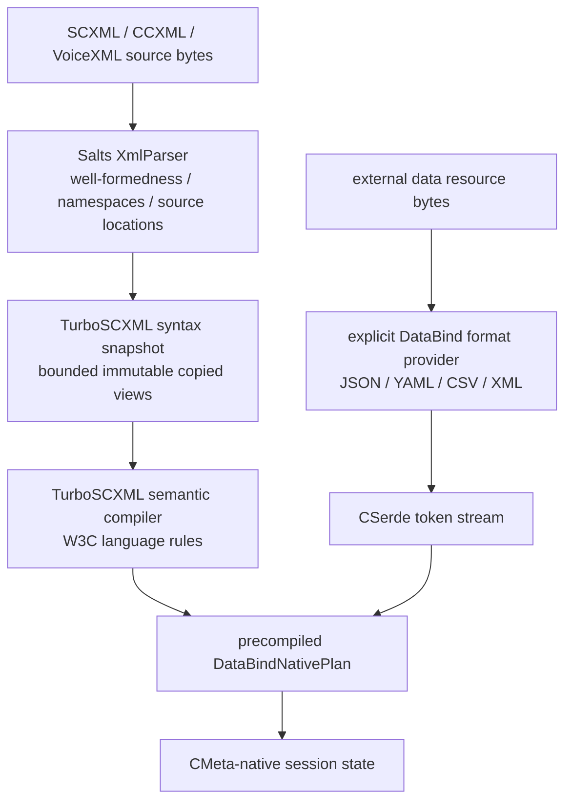

# SCXML XML parsing and DataBind boundary

This document fixes the ownership boundary between language XML and external
typed data for TurboSCXML, CCXML, and VoiceXML.

## Canonical pipeline



The two XML paths are intentionally different.

## Language XML

SCXML, CCXML, and VoiceXML documents are parsed structurally by
`Salts::XmlParser`. TurboSCXML consumes the parser's namespace-aware node,
attribute, text, and source-location views and then applies language-specific
W3C admission rules.

TurboSCXML does not own another XML lexer, parser, DOM, namespace resolver, or
well-formedness engine.

`scxml_ast.c` is not a parser. It copies the already-parsed XmlParser view into
bounded immutable program-build storage so later compiler phases do not retain
the parser document.

`scxml_xml_decode.c` is also not a parser. It performs the narrow XML
attribute entity unescape required before an already-parsed CMeta expression
attribute is compiled. Structural XML validity and namespace processing have
already completed in XmlParser.

## External typed data

A `<data src="...">` resource crosses a separate raw-resource boundary:

```text
resource adapter
    -> { bytes, explicit DataBindFormat }
    -> selected DataBind format provider
    -> CSerde reader
    -> precompiled DataBindNativePlan
    -> bounded native decode
    -> CMeta destination
```

For `DATA_BIND_FORMAT_XML`, DataBind's XML provider owns XML-format parsing.
The external payload is never fed back through the SCXML document compiler.

There is no format registry lookup, parser fallback, or implicit substitution.
The resource adapter supplies one explicit `DataBindFormat`; unsupported
formats fail before native binding.

## Control plane versus runtime

Compilation owns descriptor discovery and plan construction:

```text
CMeta destination descriptor
        |
        v
DataBindNativePlan compile
        |
        v
immutable SCXML Program
```

Runtime owns only bounded mutable resources:

- raw resource bytes and lease;
- format-reader lifetime;
- DataBind workspace;
- decode storage;
- owned/buffer byte budgets;
- diagnostic snapshot.

Runtime does not rebuild the destination descriptor graph for V4 programs.

## Ownership rules

1. XmlParser is the only structural parser for language documents.
2. TurboSCXML owns SCXML/CCXML/VoiceXML semantics, not generic XML semantics.
3. DataBind/CSerde own external format-to-native conversion.
4. CMeta owns native data/type identity.
5. External XML is DataBind XML; it is not SCXML language XML.
6. Format selection is explicit and fail-closed.
7. Format readers and resource leases are closed exactly once.
8. DataBind plans are immutable Program artifacts; decode workspace is Session-owned.

## Regression witnesses

The repository keeps both sides independently executable:

- `tests/scxml_test.c` — malformed SCXML document syntax returns
  `SCXML_XML_ERROR` before any Program is published.
- `tests/scxml_cmeta_test.c` — raw JSON `<data src>` is decoded through
  DataBind.
- `tests/scxml_cmeta_test.c` — raw XML `<data src>` is decoded through
  `DATA_BIND_FORMAT_XML` into the same CMeta destination.
- `tests/scxml_cmeta_test.c` — unsupported raw formats fail explicitly and
  do not publish partial data.
- `tests/scxml_cmeta_test.c` — runtime budgets smaller than precompiled
  DataBind plan requirements reject before resource I/O.

These witnesses are deliberately separate: parser correctness for a language
document must not depend on a DataBind format provider, and external-data
binding must not re-enter the SCXML parser.
