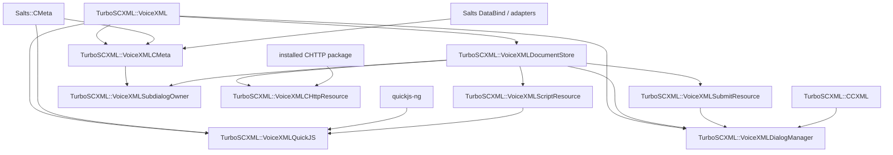
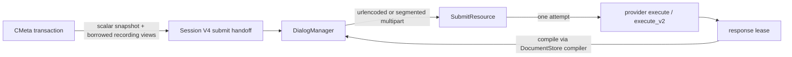

# VoiceXML architecture

## Status

TurboSCXML provides an **incubating, bounded VoiceXML 2.0/2.1 runtime**. It is
not a claim of full VoiceXML conformance. The supported surface is defined by
executable tests, explicit profile contracts, installed target dependencies,
and the support/conformance work tracked by issue #51.

The architecture has moved beyond the original non-media MVP. The canonical
runtime now includes:

- immutable base VoiceXML Program/Session execution;
- typed CMeta executable content and FIA;
- optional QuickJS script/data execution;
- prompt/media, grammar/collect, menu/initial, subdialog, record, transfer;
- DocumentStore, ScriptResource and one-attempt SubmitResource;
- external navigation and typed submit response continuation;
- CCXML DialogManager integration;
- optional CHTTP adapters that remain outside the VoiceXML core.

Unsupported language or provider capabilities fail explicitly. TurboSCXML does
not silently approximate DOM/ECMAScript semantics, provider behavior, retry
semantics, or ownership.

## Core invariants

1. **Program is immutable.** Compilers retain all request/control metadata in
   Program-owned storage. Runtime state never mutates the Program.
2. **Session is single-owner and synchronous.** Async providers publish through
   bounded generation-safe mailboxes/tickets; serialized Session progress owns
   state mutation.
3. **Profiles are explicit.** Literal, CMeta, and QuickJS behavior do not
   silently reinterpret each other.
4. **Providers are capability-gated.** Missing capability is rejected before
   provider admission or mapped to the exact runtime Event required by the
   implemented profile.
5. **Resource ownership is explicit.** Every provider-owned lease has one
   owner and one exact settlement path.
6. **POST is one-attempt.** SubmitResource never retries a request after
   provider admission; `POSSIBLY_PROCESSED` is terminal.
7. **No transport implementation enters the core.** CHTTP is an optional
   installed adapter package boundary.
8. **All retained/scratch data is bounded.** URI, source, expression, prompt,
   snapshot, recording, multipart and result storage have explicit limits.

## Installed target graph



Important dependency rules:

- `TurboSCXML::VoiceXML` does not link CMeta, DataBind, QuickJS or CHTTP.
- `VoiceXMLCMeta` owns typed/DataBind integration.
- `VoiceXMLQuickJS` owns QuickJS and the private transactional CMeta bridge.
- `VoiceXMLDialogManager` does not link CMeta or QuickJS.
- CHTTP adapters consume the installed CHTTP package; TurboSCXML does not
  duplicate CHTTP's private llhttp/TLS/DNS dependency graph.

## Compiler and Program model

### Base VoiceXML

The base compiler owns profile-neutral immutable structure and handoffs:

- document/form/block layout;
- literal exit/goto/submit/script descriptors;
- profile-neutral data request metadata when an explicit profile feature
  enables it;
- navigation, submit and script control-transfer records.

The base public compiler remains fail-closed for profile-specific surfaces it
cannot execute.

### CMeta profile

`TurboSCXML::VoiceXMLCMeta` adds a typed compiled layer over the same
VoiceXML Program lifecycle.

It owns:

- document/form/block lexical CMeta scopes;
- `var`, `assign`, `clear`, guards and typed namelists;
- transactional staged/committed root and local scope state;
- Event handlers and retry counters;
- fields, menus and initial mixed-initiative collection;
- prompt/media rows, marks and bounded prompt `foreach`;
- typed external `data` through DataBind;
- subdialog, record and transfer form items;
- typed submit scalar/recording projection.

DataBind owns typed format decoding. CMeta Session ownership does not extend
into transport providers.

### QuickJS profile

`TurboSCXML::VoiceXMLQuickJS` is an opt-in ECMAScript surface built on the
private hardened QuickJS sandbox.

It owns:

- compile-time validation for supported dynamic expressions;
- fresh hardened QuickJS contexts;
- bounded heap/stack/result storage and monotonic wall-clock deadline;
- external `script@src` / `script@srcexpr` acquisition and execution;
- transactional import/export through the private CMeta bridge;
- no-DOM `<data>` request side effects.

The supported safety contract does **not** claim a deterministic QuickJS
bytecode-instruction quota when the pinned engine ABI cannot provide one.

QuickJS `<data>` deliberately discards response bytes. It does not create a
DOM facade or persistent arbitrary JS object graph.

## Session execution and FIA

The CMeta Session is the main typed FIA owner:

```text
document initializers
  -> enter form
  -> form initializers / initial
  -> select directed item
  -> prompt / collect / provider handoff
  -> process completion
  -> local filled / form filled
  -> reselect or terminal/control transfer
```

Generation-safe provider contracts ensure stale completion cannot mutate a
newer activation.

Implemented directed/control surfaces include:

- field collect and scoped noinput/nomatch recovery;
- menu/choice and generated/explicit grammar paths;
- initial mixed-initiative collection;
- subdialog child lifecycle;
- record provider + Session-owned recording result lease;
- transfer provider + exact result/Event mapping;
- exit/return/disconnect terminal snapshots.

Async item kinds have explicit prepare/commit/discard/cancel/quiesce
boundaries. Completion ingress distinguishes accepted, stale, incompatible,
full and closed states where applicable.

## Prompt and media boundary

TurboSCXML does not implement TTS/ASR/media transport internally.

The prompt/media provider boundary receives immutable/bounded projections for:

- text;
- SSML;
- audio with fallback;
- marks;
- prompt `foreach` expansion;
- generation-owned dynamic mark names.

Provider elapsed timing may be reported through the supported observation
contract. TurboSCXML does not invent playback time when the provider did not
report it.

Barge-in, completion and cancellation are generation-affine and settle one
active provider generation exactly once.

## Grammar and collect boundary

Grammar/recognition is an external capability-gated provider surface.

The current typed profile supports the implemented static and dynamic grammar
forms, including VoiceXML 2.1 `grammar@srcexpr`, menu exact/approximate speech
policy, initial multi-slot completion and recorded-utterance result ownership.

Dynamic expressions are compiled/validated once and evaluated at the specified
activation phase. Provider requests receive bounded Session-owned or
Program-owned views only.

## Resource boundaries

### VoiceXMLDocumentStore

DocumentStore owns:

- URI resolution;
- bounded document acquisition;
- source copying/cache lifetime;
- generation-safe cache borrows;
- one configured compiler adapter.

`vxml_document_store_compile_source()` uses the same compiler for borrowed
submit-response bytes without fetching or caching them. This keeps one compiler
owner for initial/navigation/submit-response Programs.

### VoiceXMLScriptResource

ScriptResource is the acquisition boundary for external QuickJS source. A
successful lease is closed exactly once after execution/validation completes.

### VoiceXMLSubmitResource

SubmitResource owns transport-neutral request encoding and the one-attempt
provider call.

Supported generic handoffs include:

- V1 literal zero-field urlencoded submit;
- V2 ordered scalar fields;
- V3 timeout/fetchaudio policy;
- V4 ordered scalar + explicit recording multipart views.

Multipart uses one global ordered part-ref array so interleaved scalar and
recording namelist order is preserved. Recording payload bytes are borrowed
from the Session-owned lease; SubmitResource neither copies nor releases that
lease.



Timeout/fetchaudio policy is represented in the generic Session handoff.
DialogManager owns URI resolution, fetch-audio bracketing and provider
execution; CMeta only projects policy.

## DialogManager and CCXML

`TurboSCXML::VoiceXMLDialogManager` is the serialized CCXML bridge.

It owns dialog rows, document borrows, current Session, navigation/submit hop
budget, response Program lifetime and Event publication.

Store-backed managers use two profile-neutral boundaries:

1. DocumentStore's configured compiler;
2. optional `vxml_session_factory_v1` for the matching runtime profile.

This means an application can pair a CMeta or QuickJS compiler/runtime without
DialogManager linking either target or switching on profile names.

Initial documents, external navigation targets and submit-response Programs use
the same compiler/runtime pair.

## Ownership table

| Resource | Owner | Borrowed by | Settlement |
| --- | --- | --- | --- |
| immutable Program | compiler caller / DocumentStore entry | Session | destroy after Session/borrow ends |
| document source lease | document provider | DocumentStore acquire | close exactly once after copy |
| external script lease | script provider | QuickJS execution | close exactly once |
| data resource lease | data provider | CMeta/QuickJS request | close exactly once |
| prompt/collect ticket | media/recognition provider | Session generation | commit/discard/cancel/quiesce |
| record result lease | CMeta Session | submit multipart view, query APIs | Session release only |
| transfer/subdialog completion | provider mailbox | Session generation | quiesce/cancel by lifecycle |
| submit response lease | submit provider | DialogManager | close exactly once after compile/decision |

No generic transport component releases a recording lease.

## VoiceXML 2.1 delivered surface

The tracked VoiceXML 2.1 delivery includes executable positive/negative tests
for:

- dynamic grammar `srcexpr`;
- external QuickJS `script@srcexpr`;
- `mark@nameexpr` and last-result mark metadata;
- dynamic/static `data` request semantics;
- bounded prompt `foreach`;
- static `property@fetchaudio` inheritance;
- `transfer@type`;
- recorded-utterance metadata and recording shadows;
- typed CMeta submit with urlencoded and explicit-recording multipart paths.

VoiceXML 2.0 base behavior remains separately tested; 2.1-only constructs are
version-gated rather than approximated in 2.0 documents.

## Failure model

TurboSCXML uses fail-fast semantics:

- malformed descriptors: invalid structure/contract;
- missing provider capability: unsupported before callback or exact Event;
- stale generation: rejected without mutation;
- full bounded ingress: explicit FULL result;
- closed Session/provider ingress: explicit CLOSED result;
- allocation/size bound: deterministic limit/allocation failure;
- provider may-have-processed POST: terminal `POSSIBLY_PROCESSED`;
- unsupported CMeta/QuickJS value shape: reject before provider admission.

There is no implicit fallback from a newer provider contract to an older one
when doing so would discard required semantics.

## Platform and package qualification

Native SDK qualification is the release standard:

- Windows x64;
- Linux x64 Release;
- Linux ASan + UBSan;
- macOS;
- Android arm64-v8a;
- installed C and C++ consumers;
- feature-OFF / Plugin-disabled package checks where applicable.

Dependencies from GitHub packages are consumed as released/latest package
artifacts; consumer CMake must not require pinned exact package versions.

## Conformance and security

TurboSCXML remains an incubating profile. Issue #51 owns the remaining
evidence/hardening work:

- VoiceXML-specific conformance/support matrix;
- upstream provenance and executable witnesses;
- parser/runtime fuzzing and minimized regressions;
- supported option-matrix qualification;
- URI/script/recording/logging security policy;
- default redaction of sensitive prompt/input/recording data.

Do not infer VoiceXML conformance from the SCXML W3C manifest; they are
different language surfaces.

## Source of truth

This file is the canonical high-level VoiceXML architecture.

Detailed feature specs under `docs/specs/` remain authoritative for their
individual contracts. GitHub issues track delivery and qualification evidence.

Historical implementation plans are not architectural truth and should not be
used to infer current support or dependencies.
